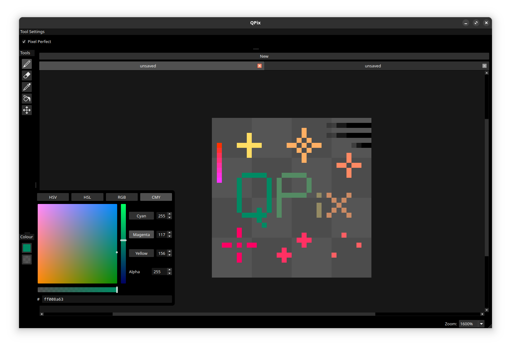

# QPix

--- WIP, very incomplete ---

A simple little pixel art editor, using Qt Widgets. Focusing on performance and UI/UX.



## Compile And Run

You need Qt6 and CMake 3.5 or higher (I'm using Qt 6.6.2 but it should work on earlier versions)

You will also need a C++20 compliant compiler.

### Compile

Navigate to project directory:

```bash
mkdir build && cd build
cmake ..
make
```
### Run

```bash
./qpix
```
